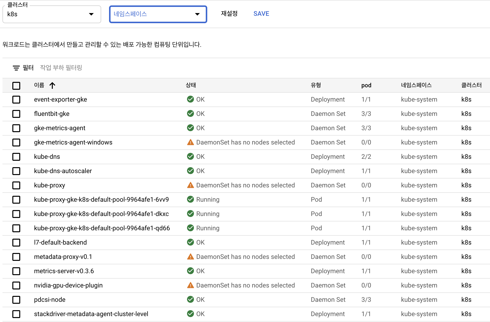

# 각종 툴 및 패키지 설치 및 설정
> Kubernetes를 사용하기 위해서 사용 해야하는 툴 및 패키지와 설정에 대해서 기록합니다.

## HyperKit & Minikube
```shell
$ brew update
# Install HyperKit
$ brew install hyperkit
# Install Minikube
$ brew install minikube
$ minikube version
```

## HyperKit & Minikube 설정
```shell
# 미니큐브를 사용하여서 쿠버네티스 v1.21.3(=>v1.22.0) 환경을 구축하고 기동
$ minikube start driver=hyperkit --kubernetes-version v1.21.3 
```


```shell
# 미니큐브 클러스터 상태 확인
$ kubectl status

# 컨텍스트 전환
$ kubectl config use-context minikube

# 노드 확인
$ kubectl get nodes

# 미니큐브 클러스터 정지
$ minikube delete
```

## Docker Desktop for Mac/Windows
1. Docker Desktop을 설치 후 
2. 설정에서 Kubernetes 목록에서 `Enable Kubernetes`를 체크 해 주세요!

```shell
# 컨텍스트 변경
$ kubectl config use-context docker-desktop

# 노드 확인
$ kubectl get nodes

# 기동 중인 쿠버네티스 관련 구성 요소 확인
$ docker container ls --format 'table {{.Image}}\t{{.Command}}' | grep -v pause
```

## Kind 설치
```shell
# kind 설치
$ brew install kind

# kind 버전 확인
$ kind version
```

### [kind 클러스터 설정 예제](./sample/chapter03/kind.yaml)
```yaml
apiVersion: kind.x-k8s.io/v1alpha4
kind: Cluster
nodes: 
- role: control-plane
  image: kindest/node:v1.18.15
- role: control-plane
  image: kindest/node:v1.18.15
- role: control-plane
  image: kindest/node:v1.18.15
- role: worker
  image: kindest/node:v1.18.15
- role: worker
  image: kindest/node:v1.18.15
- role: worker
  image: kindest/node:v1.18.15
```
```shell
# kind에서 쿠버네티스 클러스터 기동
$ kind create cluster --config kind.yaml --name kindcluster
```

**오류 발생:** 오류 발생 이유는 맥의 메모리가 부족해서 오류가 발생합니다ㅠㅠ  
[**ERROR: failed to create cluster: failed to init node with kubeadm #1437**](https://github.com/kubernetes-sigs/kind/issues/1437)


```shell
# 컨텍스트 전환
$ kubectl config use-context kind-kindcluster

# 노드 확인
$ kubectl get nodes

# 도커 컨테이너 확인 (일부 발췌)
$ docker container ls

# kind 클러스터 삭제
$kind delete cluster --name kind-kin
```

## GKE
```shell
# Google Cloud SDK(gcloud 명령어를 포함) 설치
$ curl https://sdk.cloud.google.com | bash

# 설치한 gcloud 명령어를 사용할 수 있도록 셀을 재가동
$ exec -l $SHELL

# gcloud CLI 인증
$ gcloud init
```

```shell
$ gcloud container get-server-config --zone asia-northeast3-a
Fetching server config for asia-northeast3-a
channels:
- channel: RAPID
  defaultVersion: 1.20.8-gke.900
  validVersions:
  - 1.21.3-gke.900
  - 1.21.3-gke.100
  - 1.20.9-gke.700
  - 1.20.8-gke.900
- channel: REGULAR
  defaultVersion: 1.20.8-gke.900
  validVersions:
  - 1.20.8-gke.900
- channel: STABLE
  defaultVersion: 1.18.20-gke.900
  validVersions:
  - 1.19.12-gke.2100
  - 1.19.11-gke.2101
  - 1.18.20-gke.900
defaultClusterVersion: 1.20.8-gke.900
defaultImageType: COS
validImageTypes:
- UBUNTU_CONTAINERD
- WINDOWS_SAC
- WINDOWS_LTSC
- WINDOWS_SAC_CONTAINERD
- WINDOWS_LTSC_CONTAINERD
- COS
- UBUNTU
- COS_CONTAINERD
validMasterVersions:
- 1.20.9-gke.700
- 1.20.8-gke.2100
- 1.20.8-gke.900
- 1.20.8-gke.700
- 1.19.13-gke.700
- 1.19.12-gke.2100
- 1.19.12-gke.1100
- 1.19.12-gke.900
- 1.19.12-gke.700
- 1.19.11-gke.2101
- 1.19.11-gke.1701
- 1.19.10-gke.1701
- 1.19.10-gke.1601
- 1.19.10-gke.1001
- 1.19.10-gke.1000
- 1.19.9-gke.1900
- 1.18.20-gke.3000
- 1.18.20-gke.2300
- 1.18.20-gke.900
- 1.18.20-gke.501
- 1.17.17-gke.9100
- 1.17.17-gke.8200
- 1.17.17-gke.7800
- 1.17.17-gke.7200
- 1.17.17-gke.6700
- 1.17.17-gke.6000
- 1.17.17-gke.5400
- 1.17.17-gke.4900
- 1.17.17-gke.4400
- 1.17.17-gke.3700
validNodeVersions:
- 1.20.9-gke.700
- 1.20.8-gke.2100
- 1.20.8-gke.900
# 생략
```

```shell
# GKE 클러스터 'k8s' todtjd
$ gcloud container clusters create k8s \
--cluster-version 1.18.20-gke.900 \
--zone asia-northeast3-a \
--num-nodes 3
```

```shell
$ gcloud container clusters get-credentials k8s --zone asia-northeast3-a
Fetching cluster endpoint and auth data.
kubeconfig entry generated for k8s.
```

```shell
# 현재 사용자의 이메일 주소를 가져온다
$ GCP_USER=`gcloud config get-value core/account`

# kubectl을 사용할 GCP IAM 사용자에게 클러스터 관리자 권한을 설정
$kubectl create --save-config clusterrolebinding iam-cluster-admin-binding \
--clusterrole=cluster-admin \
--user=${GCP_USER}
clusterrolebinding.rbac.authorization.k8s.io/iam-cluster-admin-binding created
```


구글 클라우드 콘솔의 자체 대시보드를 사용하여 쿠버네티스 클러스터를 관리할 수 있습니다.

```shell
# GKE 클러스터 'k8s' 삭제
$ gcloud container clusters delete k8s --zone asia-northeast3-a
The following clusters will be deleted.
 - [k8s] in [asia-northeast3-a]

Do you want to continue (Y/n)?  Y

Deleting cluster k8s...⠛
```